[TOC]


# 分布式系系统

## 1. 分布式系统概念
分布式系统是一个硬件或软件组件分布在不同的网络计算机上，彼此之间仅仅通过消息传递进行通信和协调的系统。简单来说就是一群独立计算机集合共同对外提供服务，但是对于系统的用户来说，就像是一台计算机在提供服务一样。

## 2. 分布式系统特性

- 分布性：分布式系统中的多台计算机之间在空间位置上可以随意分布，系统中的多台计算机之间没有主、从之分，即没有控制整个系统的主机，也没有受控的从机。
- 透明性：系统资源被所有计算机共享。每台计算机的用户不仅可以使用本机的资源，还可以使用本分布式系统中其他计算机的资源(包括CPU、文件、打印机等)。
- 统一性：系统中的若干台计算机可以互相协作来完成一个共同的任务，或者说一个程序可以分布在几台计算机上并行地运行。
- 通信性：系统中任意两台计算机都可以通过通信来交换信息。

## 3.分布式与集群

- 分布式（distributed）是指在多台不同的服务器中部署不同的服务模块，通过远程调用协同工作，对外提供服务。
- 集群（cluster）是指在多台不同的服务器中部署相同应用或服务模块，构成一个集群，通过负载均衡设备对外提供服务。

# 消息队列
## 1.什么是消息队列
消息队列中间件是分布式系统中重要的组件，主要解决应用耦合，异步消息，流量削锋，消息通讯等问题。实现高性能，高可用，可伸缩
和最终一致性架构，是大型分布式系统不可缺少的中间件。
## 2.消息队列解决的问题
### 1. 异步消息
场景说明:
网站注册账号，用户注册成功后，需要给其发送注册邮件和注册短信.（需要150ms）

   - 传统串行：将注册信息写入数据库成功后，发送注册邮件，再发送注册短信。、、
      <br>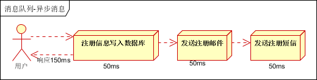
   - 传统并行：将注册信息写入数据库成功后，发送注册邮件的同时，发送注册短信。以上三个任务完成后，返回给客户端。（需要100ms）
      <br>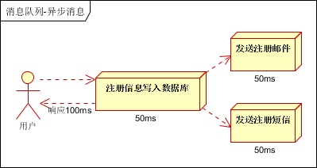
   - 消息队列：将不是必须的业务逻辑（即发送邮件与短信），异步处理。用户注册信息写入数据库后随即写入消息队列，而后即可通知
      用户注册成功。系统异步从消息队列中读取信息，执行发送短信与邮件操作。（需要55ms）
      <br>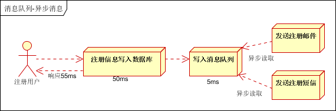

### 2. 应用解耦
场景说明：
库存订单系统

   - 传统：假如库存系统无法访问，则订单库加减库存操作将失败，从而导致订单失败。
      <br>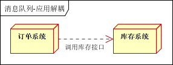
   - 消息队列：用户下单后，订单系统完成持久化处理，将消息写入消息队列，返回用户订单下单成功。库存系统订阅下单的消息，采用
      推/拉的方式，获取下单消息，库存系统根据下单信息，进行库存操作。即便库存系统暂时性崩溃，也不会影响后续订单系统继续运行，
      待库存系统修复好后也可在消息队列中获取订单信息。
      <br>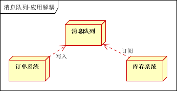

### 3. 流量削锋
场景说明：例如秒杀活动，一般会因为流量暴增，导致数据库崩溃等问题，可以通过消息队列得以解决。用户的请求，服务器接收后，
首先写入消息队列。假如消息队列长度超过最大数量，则直接抛弃用户的请求或跳转到错误页面。秒杀业务再根据消息队列中的请求信息，做后续处理。

   - <br>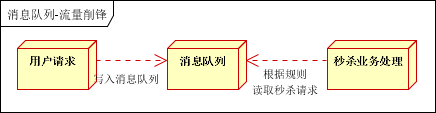

### 4. 消息通讯
消息队列一般都内置了高效的通信机制，因此也可以用在纯的消息通讯。

   - 点对点
      <br>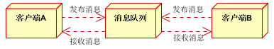
   - 聊天室（发布订阅式）
      <br>

## 3.JMS与AMQP
### 1. JMS(java消息服务):
基于JVM消息代理规范。JMS提供了两种消息模型，peer-2-peer(点对点)以及publish-subscribe（发布订阅）模型。当采用点对点模型时，消息将发送到一个队列，该队列的消息只能被一个消费者消费。而采用发布订阅模型时，消息可以被多个消费者消费。在发布订阅模型中，生产者和消费者完全独立，不需要感知对方的存在。例如ActiveMQ、HornetMQ是JMS实现
消息如何从producer端到达consumer端由message-routing来决定。在JMS中，消息路由非常简单，由producer和consumer链接到同一个queue（p2p）或者topic（pub/sub）来实现消息的路由。JMSconsumer同时支持message selector（消息选择器），通过消息选择器，consumer可以只消费那些通过了selector筛选的消息。

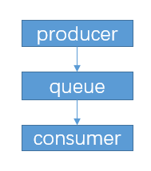

  ### 2. AMQP(高级消息队列协议):
  高级消息队列协议，也是一个消息代理的规范，兼容JMS。AMQP不从API层进行限定，而是直接定义网络交换的数据格式。这使得实现了AMQP的provider天然性就是跨平台的。
  在AMQP中，消息路由（messagerouting）和JMS存在一些差别，在AMQP中增加了Exchange和binding的角色。producer将消息发送给Exchange，binding决定Exchange的消息应该发送到那个queue，而consumer直接从queue中消费消息。queue和exchange的bind由consumer来决定。

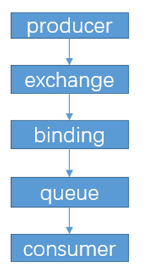

  ### 3. 两种消息队列实现支持的对比：  
 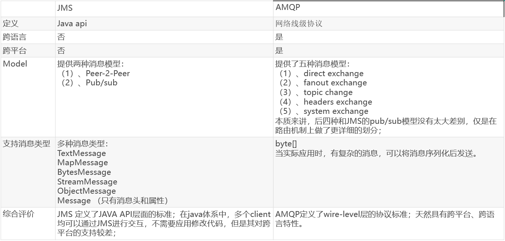 

# RabbitMQ
## 1. 理论
### 1. RabbitMQ是什么
RabbitMQ是一个由erlang开发的AMQP(Advanved Message Queue Protocol)的开源实现。
### 2.概念

   - Message: 消息，消息是不具名的，它由消息头和消息体组成。消息体是不透明的，而消息头则由一系列的可选属性组成，这些属性包括routing-key（路由键）、priority（相对于其他消息的优先权）、delivery-mode（指出该消息可能需要持久性存储）等。

   - Publisher: 消息的生产者，也是一个向交换器发布消息的客户端应用程序。

   - Exchange: 交换器，用来接收生产者发送的消息并将这些消息路由给服务器中的队列。
     Exchange有4种类型：direct(默认)，fanout, topic, 和headers，不同类型的Exchange转发消息的策略有所区别

   - Queue: 消息队列，用来保存消息直到发送给消费者。它是消息的容器，也是消息的终点。一个消息可投入一个或多个队列。消息一直在队列里面，等待消费者连接到这个队列将其取走。

   - Binding: 绑定，用于消息队列和交换器之间的关联。一个绑定就是基于路由键将交换器和消息队列连接起来的路由规则，所以可以将交换器理解成一个由绑定构成的路由表。Exchange 和Queue的绑定可以是多对多的关系。

   - connection:网络连接，比如TCP连接。

   - Channel: 信道，多路复用连接中的一条独立的双向数据流通道。信道是建立在真实的TCP连接内的虚拟连接，AMQP 命令都是通过信道发出去的，不管是发布消息、订阅队列还是接收消息，这些动作都是通过信道完成。因为对于操作系统来说建立和销毁 TCP 都是非常昂贵的开销，所以引入了信道的概念，以复用一条 TCP 连接。

   - Consumer: 消息的消费者，表示一个从消息队列中取得消息的客户端应用程序

   - Virtual Host: 虚拟主机，表示一批交换器、消息队列和相关对象。虚拟主机是共享相同的身份认证和加密环境的独立服务器域。每个 vhost 本质上就是一个 mini 版的 RabbitMQ 服务器，拥有自己的队列、交换器、绑定和权限机制。vhost 是 AMQP 概念的基础，必须在连接时指定，RabbitMQ 默认的 vhost 是 /。

   - Broker:消息服务实体。

       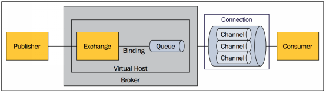

       

         
### 3.AMQP消息路由

AMQP 中消息的路由过程和 JMS 存在一些差别，AMQP 中增加了 Exchange 和 Binding 的角色。生产者把消息发布到 Exchange 上，消息最终到达队列并被消费者接收，而 Binding 决定交换器的消息应该发送到那个队列。


  ### 4. Exchange类型

  Exchang分发消息时根据类型的不同分发策略有所不同，目前共四种：direct,topic,fanout,headers.( headers 匹配 AMQP 消息的 header 而不是路由键， headers 交换器和 direct 交换器完全一致，但性能差很多，目前几乎用不到了)。
   - Fanout:转发消息到所有绑定队列
   - Direct:direct:类型的行为是"先匹配, 再投送". 即在绑定时设定一个 routing_key,消息的routing_key 匹配时, 才会被交换器投送到绑定的队列中去。(a.b匹配a.b)
   - Topic:与direct类似，多*、#（*单个单词，#一个或零个单词）

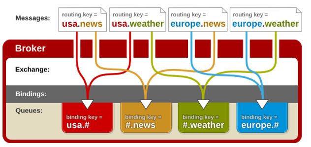

   - Headers:在队列与交换器绑定时, 会设定一组键值对规则, 消息中也包括一组键值对( headers 属性), 当这些键值对有一对, 或全部匹配时, 消息被投送到对应队列.

## 2. 实践(框架为springboot)
### 1. 添加依赖    

```xml
<dependency>
    <groupId>org.springframework.boot</groupId>
    <artifactId>spring-boot-starter-amqp</artifactId>
</dependency>
```


### 2. rabbitmq相关参数配置

```properties
spring.rabbitmq.host=localhost
spring.rabbitmq.port=5672
spring.rabbitmq.username=guest
spring.rabbitmq.password=guest
spring.rabbitmq.virtual-host=/
#消费者数量
spring.rabbitmq.listener.simple.concurrency=10
#最大消费者数量
spring.rabbitmq.listener.simple.max-concurrency=10
#消费者每次从队列获取的消息数贷。写多了，如果K时N得不到消费，数椐就一饪得不到处理
spring.rabbitmq.listener.simple.prefetch=1
#消费者自动启动
spring.rabbitmq.listener.simple.auto-startup=true
#消费者消费失败，自动重新入队
spring.rabbitmq.listener.simple.default-requeue-rejected=true
#启用发送重试 队列满了发不进去时启动重试
spring.rabbitmq.template.retry.enabled=true
#1秒钟后M试一次
spring.rabbitmq.template.retry.initial-interval=1000
#最大重试次数3次
spring.rabbitmq.template.retry.max-attempts=3
#最大间隔 10秒钟
spring.rabbitmq.template.retry.max-interval=10000
#等待间隔的倍数。如果为2   第一次 乘以2等1秒 ， 第二次 乘以2等2秒 ， 第三次 乘以2等4秒
spring.rabbitmq.template.retry.multiplier=1.0
# 开启发送确认
spring.rabbitmq.publisher-confirms=true
# 开启发送失败退回
spring.rabbitmq.publisher-returns=true
# 开启ACK
spring.rabbitmq.listener.simple.acknowledge-mode=manual 
```

### 3. Rabbitmq消息队列的操作类:RabbitAdmin与RabbitTemplate

   - (1)rabbitAdmin: 该类封装了对 RabbitMQ 的管理操作

      - Exchange操作：
         ```java
         //创建四种类型的 Exchange，均为持久化，不自动删除
         rabbitAdmin.declareExchange(new DirectExchange("direct.exchange",true,false));
         rabbitAdmin.declareExchange(new TopicExchange("topic.exchange",true,false));
         rabbitAdmin.declareExchange(new FanoutExchange("fanout.exchange",true,false));
         rabbitAdmin.declareExchange(new HeadersExchange("header.exchange",true,false));
         //删除 Exchange
         rabbitAdmin.deleteExchange("header.exchange");
         ```
      - Queue操作：
         ```java
         //定义队列，均为持久化
         rabbitAdmin.declareQueue(new Queue("debug",true));
         rabbitAdmin.declareQueue(new Queue("info",true));
         rabbitAdmin.declareQueue(new Queue("error",true));
         //删除队列      
         rabbitAdmin.deleteQueue("debug");
         //将队列中的消息全消费掉
         rabbitAdmin.purgeQueue("info",false);
         ```
      - Binding操作：
         ```java
         //绑定队列到交换器，通过路由键
         rabbitAdmin.declareBinding(new Binding("debug",Binding.DestinationType.QUEUE,
                 "direct.exchange","key.1",new HashMap()));
         
         rabbitAdmin.declareBinding(new Binding("info",Binding.DestinationType.QUEUE,
                 "direct.exchange","key.2",new HashMap()));
         
         rabbitAdmin.declareBinding(new Binding("error",Binding.DestinationType.QUEUE,
                 "direct.exchange","key.3",new HashMap()));
         
         //进行解绑
         rabbitAdmin.removeBinding(BindingBuilder.bind(new Queue("info")).
                 to(new TopicExchange("direct.exchange")).with("key.2"));
         
         //使用BindingBuilder进行绑定
         rabbitAdmin.declareBinding(BindingBuilder.bind(new Queue("info")).
                 to(new TopicExchange("topic.exchange")).with("key.#"));
         
         //声明topic类型的exchange
         rabbitAdmin.declareExchange(new TopicExchange("exchange1",true,false));
         rabbitAdmin.declareExchange(new TopicExchange("exchange2",true,false));
         
         //exchange与exchange绑定
         rabbitAdmin.declareBinding(new Binding("exchange1",Binding.DestinationType.EXCHANGE,
                 "exchange2","key.4",new HashMap()));
         ```

   - (2)RabbitTemplate: Spring AMQP 提供了 RabbitTemplate 来简化 RabbitMQ 发送和接收消息操作
      - send()：

         ```java
         Message message = new Message("hello".getBytes(),new MessageProperties());
         // 发送消息到默认的交换器，默认的路由键
         rabbitTemplate.send(message);
         // 发送消息到指定的交换器，指定的路由键
         rabbitTemplate.send("direct.exchange","key.1",message);
         // 发送消息到指定的交换器，指定的路由键
         rabbitTemplate.send("direct.exchange","key.1",message,new CorrelationData(UUID.randomUUID().toString
         ```

      - convertAndSend()：
         ```java
         User user = new User("yan");
         // 发送消息到默认的交换器，默认的路由键
         rabbitTemplate.convertAndSend(user);
         // 发送消息到指定的交换器，指定的路由键，设置消息 ID
         rabbitTemplate.convertAndSend("direct.exchange","key.1",user,new CorrelationData(UUID.randomUUID().toString()));
         // 发送消息到指定的交换器，指定的路由键，在消息转换完成后，通过 MessagePostProcessor 来添加属性
         rabbitTemplate.convertAndSend("direct.exchange","key.1",user,mes -> {
             mes.getMessageProperties().setDeliveryMode(MessageDeliveryMode.NON_PERSISTENT);
                 return mes;
         });
         ```

      - receive()：
         ```java
         // 接收来自指定队列的消息，并设置超时时间
         Message msg = rabbitTemplate.receive("debug",2000l);
         ```

      - receiveAndConvert()：
         ```java
         User user = (User) rabbitTemplate.receiveAndConvert();
         ```

### 4.Rabbitmq注解：

- @EnableRabbit:启动类使用@EnableRabbit启用@RabbitListener

- @RabbitListener: 用于注册Listener时使用的信息; 使用 @RabbitListener 注解标记方法，当监听到队列中有消息时则会进行接收并处理  

- @RabbitHandler: @RabbitListener 和 @RabbitHandler 结合使用，@RabbitListener 标注在类上面表示当有收到消息的时候，就交给 @RabbitHandler 的方法处理，具体使用哪个方法处理，根据 MessageConverter 转换后的参数类型不同类型的消息使用不同的方法来处理。

  ```java
  @RabbitListener(queues = "messageQueue")
  @RabbitHandler
  public void HandlerString(Integer a){
     System.out.println("Interger message is:"+a);
  }  
          
  @RabbitListener(queues = "messageQueue")
  @RabbitHandler
  public void HandlerStringw(String m){
     System.out.println("String message is:"+m);
  }
    
  @RabbitHandler
  @RabbitListener(queues = "messageQueue")
  public void HandlerBook(Book book){
     System.out.println("book name is:"+book.getAuthor());
  }
  ```

### 5. 可将数据转换成json发送至消息队列

```java
//配置json格式发送消息
@Bean
public MessageConverter messageConverter(){
	return new Jackson2JsonMessageConverter();
}
```


### 6.Rabbitmq消息确认机制：

- 消费者在处理消息的时候偶尔会失败或者有时会直接崩溃掉。而且网络原因也有可能引起各种问题，对于此AMQP有两种处理方式：

  - a.自动确认模式（automatic acknowledgement model）：当RabbbitMQ将消息发送给应用后，消费者端自动回送一个确认消息，此时RabbitMQ删除此消息。

  - b.显式确认模式（explicit acknowledgement model）：消费者收到消息后，可以在执行   一些逻辑后，消费者自己决定什么时候发送确认回执（acknowledgement），RabbitMQ收到回执后才删除消息，这样就保证消费端不会丢失消息
    如果一个消费者在尚未发送确认回执的情况下挂掉了，那么消息会被重新放入队列，并且在还有其他消费者存在于此队列的前提下，立即投递给另外一个消费者。如果当时没有可用的消费者了，消息代理会死等下一个注册到此队列的消费者，然后再次尝试投递。(RabbitMQ里的消息是不会过期。当消费者挂掉后，RabbitMQ会不断尝试重推。所有单个消息的推送可能花费很长的时间)

  - 实现：

    ```java
    void basicAck(long deliveryTag, boolean multiple) throws IOException;
    ```

    - deliveryTag：发布的每一条消息都会获得一个唯一的deliveryTag，(任何channel上发布的第一条消息的deliveryTag为1，此后的每一条消息都会加1)，deliveryTag在channel范围内是唯一的(deliveryTag获取方法：message.getMessageProperties().getDeliveryTag())。
    - multiple：批量确认标志。如果值为true，则执行批量确认，此deliveryTag之前收到的消息全部进行确认; 如果值为false，则只对当前收到的消息进行确认。

    ```java
      @RabbitListener(queues = "messageQueue")
      public void Ack(Book book,Message message,Channel channel){
        try {
           channel.basicAck(message.getMessageProperties().getDeliveryTag(),true);
           } catch (IOException e) {
           e.printStackTrace();
        }
      }
    ```

- 拒绝消息

  - 单条消息拒绝

    ```java
     void basicReject(long deliveryTag, boolean requeue) throws IOException;
    ```

    - deliveryTag: 发布的每一条消息都会获得一个唯一的deliveryTag，deliveryTag在channel范围内是唯一的
    - requeue: 表示如何处理这条消息，如果值为true，则重新放入RabbitMQ的发送队列，如果值为false，则通知RabbitMQ销毁这条消息

  - ```java
    @RabbitListener(queues = "messageQueue")
    public void refuse1(Book book,Message message,Channel channel){
        try {
            channel.basicReject(message.getMessageProperties().getDeliveryTag(),true);
        } catch (IOException e) {
            e.printStackTrace();
        }
    }
    ```

  - 多条消息拒绝

    ```java
      void basicNack(long deliveryTag, boolean multiple, boolean requeue) throws IOException;
    ```

    - deliveryTag：发布的每一条消息都会获得一个唯一的deliveryTag，deliveryTag在channel范围内是唯一的 
    - multiple：批量确认标志。如果值为true，包含本条消息在内的、所有比该消息deliveryTag值小的 消息都被拒绝了（除了已经被 ack 的以外）;如果值为false，只拒绝三本条消息 
    - requeue：表示如何处理这条消息，如果值为true，则重新放入RabbitMQ的发送队列，如果值为false，则通知RabbitMQ销毁这条消息

### 7. Rabbitmq设置预取消息数量：

RabbitMQ收到消息后，就向消费者送。但是如果消息过多，且消息的数量超过了消息者处理能力从而导致其崩溃。此时我们可以通过prefetchCount 限制每个消费者在收到下一个确认回执前一次可以最大接受多少条消息。即如果设置prefetchCount =1，RabbitMQ向这个消费者发送一个消息后，再这个消息的消费者对这个消息进行ack之前，RabbitMQ不会向这个消费者发送新的消息

```java
 // 每个客户端每次最后获取N个消息
 channel.basicQos(1);
```


### 8. Rabbitmq消息分配策略：

如果同一个队列，有多个消费者消费这个队列。RabbitMQ默认是按照轮询的策略发送消息，即发送的顺序是消费者1，消费者2，消费者1，消费者2…。所以平均下来，每个消费者消费的消息数量几乎相同。

### 9. Rabbitmq消息优先级

```java
//队列优先级
//队列优先级只能声明一次，不可改变
     Map<String, Object> args= new HashMap<>();
     //设置队列优先级为100
     args.put("x-max-priority", 100);
     amqpAdmin.declareQueue(new Queue("messageQueue",true,false,false,args));
     amqpAdmin.declareBinding(new Binding("messageQueue", Binding.DestinationType.QUEUE,
     "messageExchange","message",null));


// 消息优先级：    
//优先级高的消息优先被消费
     Book book1 = new Book("1","1");
     Book book2 = new Book("2","2");
     Book book3 = new Book("3","3");
     Book book4 = new Book("4","4");
     Book book5 = new Book("5","5");
     Book book6 = new Book("6","6");
     rabbitTemplate.convertAndSend("messageExchange","message" ,
           book3,message -> {message.getMessageProperties().setPriority(4);return message;});
     rabbitTemplate.convertAndSend("messageExchange","message" ,
           book4,message -> {message.getMessageProperties().setPriority(5);return message;});
     rabbitTemplate.convertAndSend("messageExchange","message" ,
           book2,message -> {message.getMessageProperties().setPriority(6);return message;});
     rabbitTemplate.convertAndSend("messageExchange","message" ,
           book1,message -> {message.getMessageProperties().setPriority(3);return message;});
     rabbitTemplate.convertAndSend("messageExchange","message" ,
           book6,message -> {message.getMessageProperties().setPriority(8);return message;});
     rabbitTemplate.convertAndSend("messageExchange","message" ,
           book5,message -> {message.getMessageProperties().setPriority(10);return message;});
```
设置成功后消息按照优先级从高到底顺序排列：
<br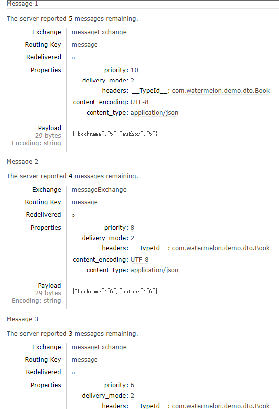

注意：只有当消费者不足，不能及时进行消费的情况下，优先级队列才会生效；同时队列、消息上均要设置优先级才可生效

## 3. RabbitMQ集群

### 1. 概念
RabbitMQ这款消息队列中间件产品本身是基于Erlang编写，Erlang语言天生具备分布式特性（通过同步Erlang集群各节点的magic cookie来实现）。因此，RabbitMQ天然支持Clustering。这使得RabbitMQ本身不需要像ActiveMQ、Kafka那样通过ZooKeeper分别来实现HA方案和保存集群的元数据。集群是保证可靠性的一种方式，同时可以通过水平扩展以达到增加消息吞吐量能力的目的。
### 2. RabbitMQ集群的元数据同步
在RabbitMQ的集群模式中，Exchange(交换器)的元数据信息在所有节点上是一致的，而Queue（存放消息的队列）的完整数据则只会存在于它所创建的那个节点上。其他节点只知道这个queue的metadata信息和一个指向queue的owner node的指针。
RabbitMQ集群会始终同步以下四种类型的内部元数据（类似索引）：

 - 队列元数据：队列名称和它的属性；
 - 交换器元数据：交换器名称、类型和属性；
 - 绑定元数据：一张简单的表格展示了如何将消息路由到队列；
 - vhost元数据：为vhost内的队列、交换器和绑定提供命名空间和安全属性。

 因此，当用户访问其中任何一个RabbitMQ节点时，通过rabbitmqctl查询到的queue／user／exchange/vhost等信息都是相同的。
 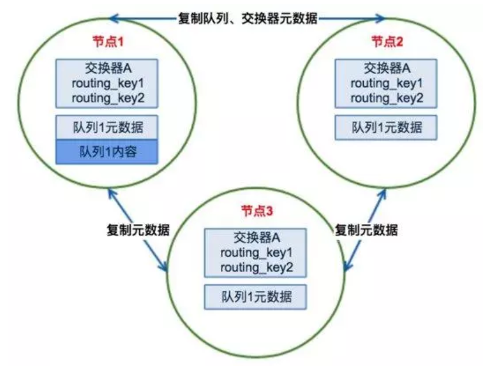

 ### 3. RabbitMQ的运行模式

 - 单一模式：即单机情况不做集群，就单独运行一个rabbitmq。
 - 普通模式：默认模式，以两个节点（rabbit01、rabbit02）为例来进行说明。对于Queue来说，消息实体只存在于其中一个节点rabbit01（或者rabbit02），rabbit01和rabbit02两个节点仅有相同的元数据，即队列的结构。当消息进入rabbit01节点的Queue后，consumer从rabbit02节点消费时，RabbitMQ会临时在rabbit01、rabbit02间进行消息传输，把A中的消息实体取出并经过B发送给consumer。所以consumer应尽量连接每一个节点，从中取消息。即对于同一个逻辑队列，要在多个节点建立物理Queue。否则无论consumer连rabbit01或rabbit02，出口总在rabbit01，会产生瓶颈。当rabbit01节点故障后，rabbit02节点无法取到rabbit01节点中还未消费的消息实体。如果做了消息持久化，那么得等rabbit01节点恢复，然后才可被消费；如果没有持久化的话，就会产生消息丢失的现象。
 - 镜像模式：把需要的队列做成镜像队列，存在与多个节点属于RabbitMQ的HA方案。该模式解决了普通模式中的问题，其实质和普通模式不同之处在于，消息实体会主动在镜像节点间同步，而不是在客户端取数据时临时拉取。该模式带来的副作用也很明显，除了降低系统性能外，如果镜像队列数量过多，加之大量的消息进入，集群内部的网络带宽将会被这种同步通讯大大消耗掉。所以在对可靠性要求较高的场合中适用。

# ActiveMQ
## 1. 理论
### 1. ActiveMQ是什么
ActiveMQ是Apache软件基金下的一个开源软件，它遵循JMS规范（Java Message Service），是消息驱动中间件软件（MOM）

### 2. JMS消息传送模型

   - 点对点
      在点对点消息传送模型中，应用程序由消息队列，发送者，接收者组成。每一个消息发送给一个特殊的消息队列，该队列保存了所有发送给它的消息(除了被接收者消费掉的和过期的消息)。特性如下：
     - 每个消息只有一个接收者；
     - 消息发送者和接收者并没有时间依赖性；
     - 当消息发送者发送消息的时候，无论接收者程序在不在运行，都能获取到消息；
     - 当接收者收到消息的时候，会发送确认收到通知（acknowledgement）
       

   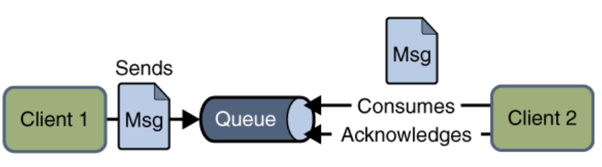
   - 发布/订阅

     在发布/订阅消息模型中，发布者发布一个消息，该消息通过topic传递给所有的客户端。在这种模型中，发布者和订阅者彼此不知道对方，是匿名的且可以动态发布和订阅topic。topic主要用于保存和传递消息，且会一直保存消息直到消息被传递给客户端。特 性 如下：

     - 一个消息可以传递给多个订阅者
     - 发布者和订阅者有时间依赖性，只有当客户端创建订阅后才能接受消息，且订阅者需一直保持活动状态以接收消息。
     - 为了缓和这样严格的时间相关性，JMS允许订阅者创建一个可持久化的订阅。这样，即使订阅者没有被激活（运行），它也能接收到发布者的消息。

​        


​          

   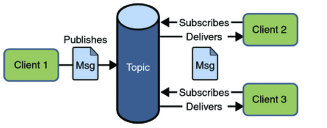

### 3. JMS接收消息方式

- 同步：
  使用同步方式接收消息的话，消息订阅者调用receive()方法。在receive()中，消息未到达或在到达指定时间之前，方法会阻塞，直到消息可用。
- 异步：
  使用异步方式接收消息的话，消息订阅者需注册一个消息监听者，类似于事件监听器，只要消息到达，JMS服务提供者会通过调用监听器的onMessage()递送消息。

### 4. JMS应用程序基本模块组成

 - 管理对象（Administered objects）
 - 连接工厂（Connection Factories）和目的地（Destination）
 - 连接对象（Connections）
 - 会话（Sessions）
 - 消息生产者（Message Producers）
 - 消息消费者（Message Consumers）
 - 消息监听者（Message Listeners）

 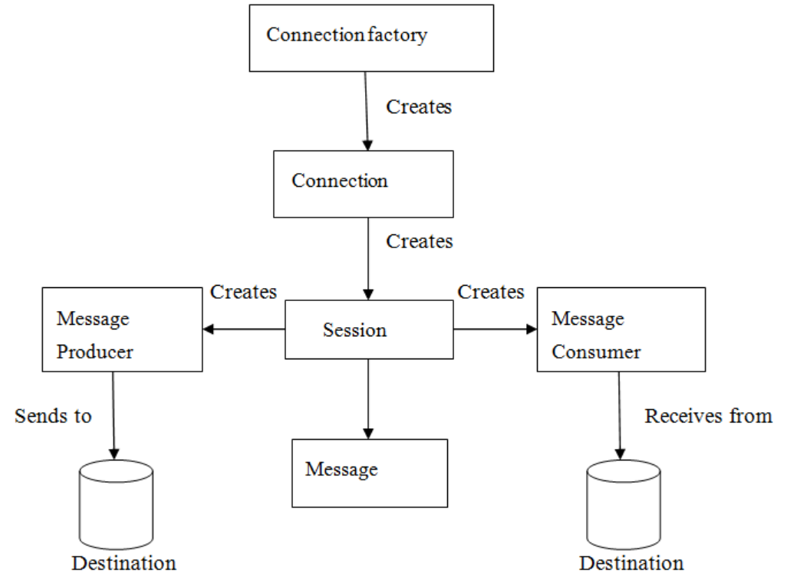
 - JMS管理对象：管理对象（Administered objects）是预先配置的JMS对象，由系统管理员为使用JMS的客户端创建，主要有两个被管理的对象：连接工厂（ConnectionFactory）、目的地（Destination）。这两个管理对象由JMS系统管理员通过使用Application Server管理控制台创建，存储在应用程序服务器的JNDI名字空间或JNDI注册表。
    连接工厂（ConnectionFactory）：客户端使用一个连接工厂对象连接到JMS服务提供者，它创建了JMS服务提供者和客户端之间的连接。JMS客户端（如发送者或接受者）会在JNDI名字空间中搜索并获取该连接。使用该连接，客户端能够与目的地通讯，往队列或话题发送/接收消息
 - 目的地（Destination）：目的地指明消息被发送的目的地以及客户端接收消息的来源。JMS使用两种目的地，队列和话题。
 - JMS连接：连接对象封装了与JMS提供者之间的虚拟连接，如果我们有一个ConnectionFactory对象，可以使用它来创建一个连接。
 - JMS会话（session）: Session是一个单线程上下文，用于生产和消费消息，可以创建出消息生产者和消息消费者。Session对象实现了Session接口，在创建完连接后，我们可以使用它创建Session。
 - JMS消息生产者：消息生产者由Session创建，用于往目的地发送消息。生产者实现MessageProducer接口，我们可以为目的地、队列或话题创建生产者；
 - JMS消息消费者：消息消费者由Session创建，用于接受目的地发送的消息。消费者实现MessageConsumer接口，，我们可以为目的地、队列或话题创建消费者。
 - JMS消息监听器：JMS消息监听器是消息的默认事件处理者，他实现了MessageListener接口，该接口包含一个onMessage方法，在该方法中需要定义消息达到后的具体动作。通过调用setMessageListener方法我们给指定消费者定义了消息监听器

### 5. JMS消息结构：

 - 消息头: JMS消息头预定义了若干字段用于客户端与JMS提供者之间识别和发送消息
 - 消息属性: 我们可以给消息设置自定义属性，这些属性主要是提供给应用程序的。对于实现消息过滤功能，消息属性非常有用，JMS API定义了一些标准属性，JMS服务提供者可以选择性的提供部分标准属性。
 - 消息体: 在消息体中，JMS API定义了五种类型的消息格式，让我们可以以不同的形式发送和接受消息，具体如下：
 - Text message : javax.jms.TextMessage，表示一个文本对象。
 - Object message : javax.jms.ObjectMessage，表示一个JAVA对象。
 - Bytes message : javax.jms.BytesMessage，表示字节数据。
 - Stream message :javax.jms.StreamMessage，表示java原始值数据流。
 - Map message : javax.jms.MapMessage，表示键值对。

### 6. Topic、Queue两种消息传输方式对比
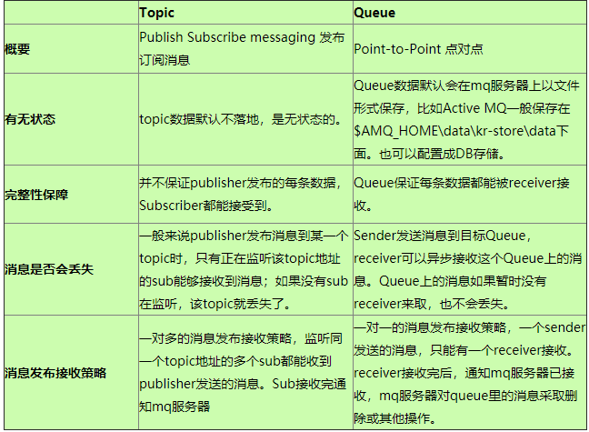
## 2. 实践(框架为spirngboot)
### 1. JmsTemplate
&nbsp;&nbsp;&nbsp;&nbsp;&nbsp;&nbsp;&nbsp;&nbsp;JmsTemplate类是JMS核心包中的中心类。它简化了 JMS 的使用，因为在发送或同步接收消息时它帮我们处理了资源的创建和释放。使用JmsTemplate的代码只需要实现规范中定义的回调接口。在JmsTemplate中通过调用代码让MessageCreator回调接口用所提供的会话(Session)创建消息。然而，为了顾及更复杂的 JMS API 应用，回调接口SessionCallback将 JMS 会话提供给用户，回调接口ProducerCallback则公开了Session和MessageProducer的组合。

​       JMS API 公开了发送方法的两种类型，一种接受交付模式、优先级和存活时间作为服务质量（QOS）参数，另一种则使用缺省值作为 QOS 参数（无需参数）方式。由于 JmsTemplate 中有很多发送方法，QOS 参数用 bean 属性进行暴露设置，从而避免在一系列发送方法中的重复。同样地，使用setReceiveTimeout属性设置用于同步接收调用的超时值。

​        一些 JMS 提供者通过配置ConnectionFactory，管理方式上允许默认的 QOS值 的设置。MessageProducer的发送方法send(Destination destination, Message message)在那些专有的 JMS 中将会使用不一样的 QOS 默认值。 所以，为了提供对 QOS 值域、的统一管理，JmsTemplate必须通过设置布尔值属性isExplicitQosEnabled为true，使它能够使用自己的QOS值。(优先级设置解决方法)

### 2. Activemq简单使用

 - 添加maven依赖：
   ````xml
   <dependency>
        <groupId>org.springframework.boot</groupId>
        <artifactId>spring-boot-starter-activemq</artifactId>
   </dependency>
   ````

 - 创建Activemq连接工厂：
   ````java
   @Bean
   //    创建 ActiveMQ 连接工厂
   public ConnectionFactory connectionFactory(){
       ActiveMQConnectionFactory connectionFactory = new ActiveMQConnectionFactory();
       connectionFactory.setBrokerURL("tcp://localhost:61616");
       connectionFactory.setUserName("admin");
       connectionFactory.setPassword("admin");
       return connectionFactory;
   }
   ````
   或者在springboot配置文件中直接进行配置：
   ````properties
   spring.activemq.broker-url=tcp://47.106.81.161:61616
   spring.activemq.user=admin
   spring.activemq.password=admin
   ````

 - 消息的发送：
   关于消息的发送，是通过 JMS 核心包中的JmsTemplate类来实现的，它简化了 JMS 的使用，因为在发送或同步接收消息时它帮我们处理了资源的创建和释放。它需要引用我们上面创建的连接工厂。

   ````java
   public void sendQueue(){
      Destination destination = new ActiveMQQueue("queue");
      jmsTemplate.convertAndSend(destination, "message"); 
   }
   public void sendTopic(){
   Destination destination = new ActiveMQTopic("mytopic");
   jmsTemplate.convertAndSend(destination,"topicMessage");
   }
   ````

 - 消息接收：
    - 配置监听容器工厂：
    ````java
    @Bean(name = "jmsQueueListenerCF")
    public DefaultJmsListenerContainerFactory jmsQueueListenerContainerFactory(ConnectionFactory connectionFactory) {
       DefaultJmsListenerContainerFactory factory = new DefaultJmsListenerContainerFactory();
       factory.setConnectionFactory(connectionFactory);
       //设置连接数
       factory.setConcurrency("3-10");
       //重连间隔时间
       factory.setRecoveryInterval(1000L);
       factory.setSessionAcknowledgeMode(4);
       return factory;
    }
    @Bean(name = "jmsTopicListenerCF")
    public DefaultJmsListenerContainerFactory jmsTopicListenerContainerFactory(ConnectionFactory connectionFactory) {
       DefaultJmsListenerContainerFactory factory = new DefaultJmsListenerContainerFactory();
       factory.setConnectionFactory(connectionFactory);
       factory.setConcurrency("1");
       factory.setPubSubDomain(true);
       return factory;
     } 
    ````
     - 消息接收：
     ```` java
     @JmsListener(destination = "queue?consumer.prefetchSize=100")
     public void receiveQueue(String ss, Message message) throws JMSException {
       System.out.println("queue receive message is：" + ss);
       System.out.println(message);
      //      消息确认
       message.acknowledge();
     }
     
     @JmsListener(destination = "mytopic",containerFactory = "jmsTopicListenerCF")
     public void receiveTopic(String message) {
       System.out.println("topic receive message is：" + message);
     }
     ````
     @JmsListener默认接收为Queue消息

### 3. Activemq队列的创建
Activemq队列是不需要我们提前定义好的，它和 RabbitMQ 不一样，它会在我们需要的时候动态的创建的。
### 4. Activemq消息确认机制（ack机制）
ACK模式描述了consumer与broker确认消息的方式(时机),比如当消息被consumer接收之后,consumer将在何时确认消息。对于broker而言，只有接收到ACK指令,才会认为消息被正确的接收或者处理成功了,通过ACK，可以在consumer（/producer）与Broker之间建立一种简单的“担保”机制。Ack机制有：

 - AUTO_ACKNOWLEDGE = 1    自动确认
 - CLIENT_ACKNOWLEDGE = 2    客户端手动确认   
 - DUPS_OK_ACKNOWLEDGE = 3    自动批量确认
 - SESSION_TRANSACTED = 0    事务提交并确认
 - INDIVIDUAL_ACKNOWLEDGE = 4    单条消息确认 （activemq 独有）

 用法：
 - ````java
    factory.setSessionAcknowledgeMode(4);
    ````
 注意：
关于Spring下ActiveMQ的消息确认机制有一个问题，发现AcknowledgeMode设置成Session.CLIENT_ACKNOWLEDGE并没有什么用，还是会自动确认。源码如下，当设置sessionAcknowledgeMode为2时，虽然是客户端手动确认，但是却被spring自动确认了，造成设置无效。这时只需要把sessionAcknowledgeMode的值设置成activemq自定义的类型INDIVIDUAL_ACKNOWLEDGE = 4即可
 - ````java
     protected void commitIfNecessary(Session session, Message message) throws JMSException {
         if (session.getTransacted()) {
             if (this.isSessionLocallyTransacted(session)) {
                 JmsUtils.commitIfNecessary(session);
             }
         } else if (message != null && this.isClientAcknowledge(session)) {
             message.acknowledge();
         }
     }
     ````
 - ````java
     protected boolean isClientAcknowledge(Session session) throws JMSException {
         return session.getAcknowledgeMode() == 2;
     }
         
     ````

### 5. Activemq消息预取   
预取限制(prefetch limit)：表示在某个时间段内，可能向消费者传输的最大消息量，如果达到该上限，那么停止发送，直到ActiveMQ收到消费者的acknowledgements(确认，表示已经处理了该消息)。prefetch limit可以针对每个不同的consumer来设置。
    为了获取更高的性能，prefetch limit当然是越大越好，只要consumer有足够大的消息缓冲区(messagevolume)。如果消息的总量非常少，而且每个消息的处理时间非常的长，那么，可以将prefetch设置为1，这样，每次向consumer发送一个消息，等其确认已经处理完毕后，再发送第二个。
    (Ps:如果prefetch设置为0，表示consumer每次　主动向activeMQ要求传输最大的数据量，而不是被动地接收消息。)    
设置方法：

  - 所有的目的地每次最大取50条消息。在连接工厂连接URL里设置:
    ````properties
    tcp://localhost:61616?jms.prefetchPolicy.all=50
    ````
  - 队列每次取1条消息，在连接工厂连接URL里设置
    ````properties
    tcp://localhost:61616?jms.prefetchPolicy.queuePrefetch=1
    ````
  - 特定队列每次预取10条消息。在创建队列时或监听方法上注解设置。
    ````java
    queue = new ActiveMQQueue("TEST.QUEUE?consumer.prefetchSize=10");
    or
    @JmsListener(destination="queue?consumer.prefetchSize=100")
    ````
    

### 6. Activemq消息的优先级 

- 问题：
  ````java
    Text Message = session.creteTextMessage(text);
    message.setJMSPriority(0);
  ````
  以上写法设置优先级无效。由于JMS provider将查看消息上的消息优先级属性，并在将消息放入队列之前调用setJMSPriority方法设置默认优先级。默认消息优先级为4（普通优先级），因此若使用setJMSPriority方法设置消息优先级，消息优先级不会是开发人员最初预期设置的优先级。   
- 解决方案：
  JMS API有两种发送方法，一种采用发送模式、优先级和存活时间作为服务质量（QOS）参数，另一种使用无需QOS参数的缺省值方法。由于在 JmsTemplate 中有许多种发送方法，QOS参数通过bean的属性方式进行设置，从而避免在多种发送方法中重复。同样，使用 setReceiveTimeout 属性值来设置同步接收调用的超时值。某些JMS供应者允许通过ConnectionFactory的配置来设置缺省的QOS值。这样在调用 MessageProducer 的发送方法 send(Destination destination, Message message) 时会使用那些不同的QOS缺省值，而不是JMS规范中定义的值。所以，为了提供对QOS值的一致管理，JmsTemplate必须通过设置布尔值属性 isExplicitQosEnabled 为true，使它能够使用自己的QOS值:
  ````java
   jmsTemplate.setExplicitQosEnabled(true);
   jmsTemplate.setPriority(4);
   jmsTemplate.convertAndSend("priorityqueue1","4");
   jmsTemplate.setPriority(3);
   jmsTemplate.convertAndSend("priorityqueue1","3");
   jmsTemplate.setPriority(6);
   jmsTemplate.convertAndSend("priorityqueue1","6");
   jmsTemplate.setPriority(7);
   jmsTemplate.convertAndSend("priorityqueue1","7");
   jmsTemplate.setPriority(5);
   jmsTemplate.convertAndSend("priorityqueue1","5");
  ````

### 7. Virtual topic

- 使用场景：
   有一个application, 订阅一个Topic消息, 假设这个application部署到2台server上时，2台server会同时监听这个Topic, 这样会导致一个消息重复消费2次，这不符合一些特定的应用场景。
    如果设置成Queue，能确保一个消息只被消费一次，但就不能有其他的application同时消费这个消息，也不符合一些特定的应该场景。为了达到在分布式部署的情况下，一个消息， 被同一个application只消费一次，同时也能被其他的application消费，就引入Virtual Topic. 这种方式可以说：在Topic消息层面上，实现负载均衡。
- 代码实现：
   - 配置：
   ````properties
   activemq.virtual.topic=VirtualTopic.Topic1
   activemq.virtual.topic.A=Consumer.A.VirtualTopic.Topic1
   activemq.virtual.topic.B=Consumer.B.VirtualTopic.Topic1
   ````
   - 具体：
   ````java
   @Bean(name = "firstQueueListener")
   public DefaultJmsListenerContainerFactory virtualTopicListenerFactory(ConnectionFactory connectionFactory) {
       DefaultJmsListenerContainerFactory factory =
           new DefaultJmsListenerContainerFactory();
       factory.setConnectionFactory(connectionFactory);
       factory.setSessionAcknowledgeMode(4);
       return factory;
   }
   ````
   ````java
   @JmsListener(destination = "${activemq.virtual.topic.A}?consumer.prefetchSize=1", containerFactory = "firstQueueListener")
   @Async
   public void receiveVTopicA1(String msg, Message message) throws JMSException, InterruptedException {
       System.out.println(Thread.currentThread().getName() + ": vtopic A1===========" + msg);
       Thread.sleep(500);
       message.acknowledge();
   }
   
   @JmsListener(destination = "${activemq.virtual.topic.A}?consumer.prefetchSize=1", containerFactory = "firstQueueListener")
   @Async
   public void receiveVTopicA2(String msg, Message message) throws JMSException, InterruptedException {
       System.out.println(Thread.currentThread().getName() + ": vtopic A2===========" + msg);
       Thread.sleep(400);
       message.acknowledge();
   }
   
   @JmsListener(destination = "${activemq.virtual.topic.B}?consumer.prefetchSize=1", containerFactory = "firstQueueListener")
   @Async
   ublic void receiveVTopicB(String msg,Message message) throws JMSException, InterruptedException {
       System.out.println(Thread.currentThread().getName() + ": vtopic B===========" + msg);
       Thread.sleep(400);
       message.acknowledge();
   }
   ````
- virtual topic命名规范：

  - Topic命名： VirtualTopic.xxx

- 消费者命名： Consumer.yyy.VirtualTopic.xxx

# Kafka   

## 1. 理论
### 1. kafka背景
Kafka 是一个消息系统，原本开发自 LinkedIn，用作 LinkedIn 的活动流（Activity Stream）和运营数据处理管道（Pipeline）的基础
### 2. kafka简介
Kafka 是一种分布式的，基于发布 / 订阅的消息系统。主要设计目标如下：

- 以时间复杂度为 O(1) 的方式提供消息持久化能力，即使对 TB 级以上数据也能保证常数时间复杂b.度的访问性能。
- 高吞吐率。即使在非常廉价的商用机器上也能做到单机支持每秒 100K 条以上消息的传输。
- 支持 Kafka Server 间的消息分区，及分布式消费，同时保证每个 Partition 内的消息顺序传输。
  同时支持离线数据处理和实时数据处理。
- Scale out：支持在线水平扩展。

### 3. 术语

- Broker：Kafka 集群包含一个或多个服务器，这种服务器被称为 broker。
- Topic：每条发布到 Kafka 集群的消息都有一个类别，这个类别被称为 Topic。（物理上不同 Topic 的消息分开存储，逻辑上一个 Topic 的消息虽然保存于一个或多个 broker 上，但用户只需指定消息的 Topic 即可生产或消费数据而不必关心数据存于何处）。
- Partition：Partition 是物理上的概念，每个 Topic 包含一个或多个 Partition。
- Producer：负责发布消息到 Kafka broker。
- Consumer：消息消费者，向 Kafka broker 读取消息的客户端。
- Consumer Group：每个 Consumer 属于一个特定的 Consumer Group（可为每个 Consumer 指定 group name，若不指定 group name 则属于默认的 group）。

### 4. 交互流程
&nbsp;&nbsp;&nbsp;&nbsp;&nbsp;&nbsp;&nbsp;Kafka 是一个基于分布式的消息发布-订阅系统，它被设计成快速、可扩展的、持久的。与其他消息发布-订阅系统类似，Kafka 在主题当中保存消息的信息。生产者向主题写入数据，消费者从主题读取数据。由于 Kafka 的特性是支持分布式，同时也是基于分布式的，所以主题也是可以在多个节点上被分区和覆盖的。
&nbsp;&nbsp;&nbsp;&nbsp;&nbsp;&nbsp;&nbsp;信息是一个字节数组，程序员可以在这些字节数组中存储任何对象，支持的数据格式包括 String、JSON、Avro。Kafka 通过给每一个消息绑定一个键值的方式来保证生产者可以把所有的消息发送到指定位置。属于某一个消费者群组的消费者订阅了一个主题，通过该订阅消费者可以跨节点地接收所有与该主题相关的消息，每一个消息只会发送给群组中的一个消费者，所有拥有相同键值的消息都会被确保发给这一个消费者。
&nbsp;&nbsp;&nbsp;&nbsp;&nbsp;&nbsp;&nbsp;Kafka 设计中将每一个主题分区当作一个具有顺序排列的日志。同处于一个分区中的消息都被设置了一个唯一的偏移量。Kafka 只会保持跟踪未读消息，一旦消息被置为已读状态，Kafka 就不会再去管理它了。Kafka 的生产者负责在消息队列中对生产出来的消息保证一定时间的占有，消费者负责追踪每一个主题 (可以理解为一个日志通道) 的消息并及时获取它们。基于这样的设计，Kafka 可以在消息队列中保存大量的开销很小的数据，并且支持大量的消费者订阅。

### 5. 拓扑结构
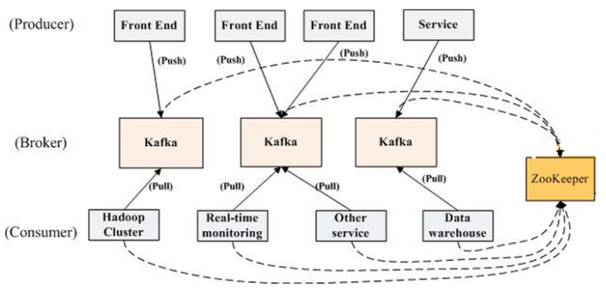

一个典型的 Kafka 集群中包含若干 Producer（可以是 web 前端产生的 Page View，或者是服务器日志，系统 CPU、Memory 等），若干 broker（Kafka 支持水平扩展，一般 broker 数量越多，集群吞吐率越高），若干 Consumer Group，以及一个Zookeeper集群。Kafka 通过 Zookeeper 管理集群配置，选举 leader，以及在 Consumer Group 发生变化时进行 rebalance。Producer 使用 push 模式将消息发布到 broker，Consumer 使用 pull 模式从 broker 订阅并消费消息。
### 6. Topic & Partition & log
主题（topic）是发布的数据流的类别或名称。在逻辑上可以被认为是一个 queue，每条消费都必须指定它的 Topic，可以简单理解为必须指明把这条消息放进哪个 queue 里。为了使得 Kafka 的吞吐率可以线性提高，物理上把 Topic 分成一个或多个 Partition，每个 Partition 在物理上对应一个文件夹，该文件夹下存储这个 Partition 的所有消息和索引文件。若创建 topic1 和 topic2 两个 topic，且分别有 13 个和 19 个分区，则整个集群上会相应会生成共 32 个文件夹。topic在Kafka中，总是支持多订阅者的; 也就是说，主题可以有零个，一个或多个消费者订阅写到相应主题的数据. 对应每一个主题，Kafka集群会维护像一个如下这样的分区的日志:
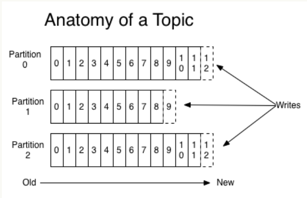
每个分区都是一个有序的，不可变的，并且不断被附加的记录序列，也就是一个结构化提交日志（commit log）.为了保证唯一标性识分区中的每个数据记录，分区中的记录每个都会被分配一个一个叫做偏移（offset）顺序的ID号. 通过一个可配置的保留期，Kafka集群会保留所有被发布的数据，不管它们是不是已经被消费者处理. 例如，如果保留期设置为两天，则在发布记录后的两天内，数据都可以被消费，之后它将被丢弃以释放空间。 Kafka的性能是不为因为数据量大小而受影响的，因此长时间存储数据并不成问题。
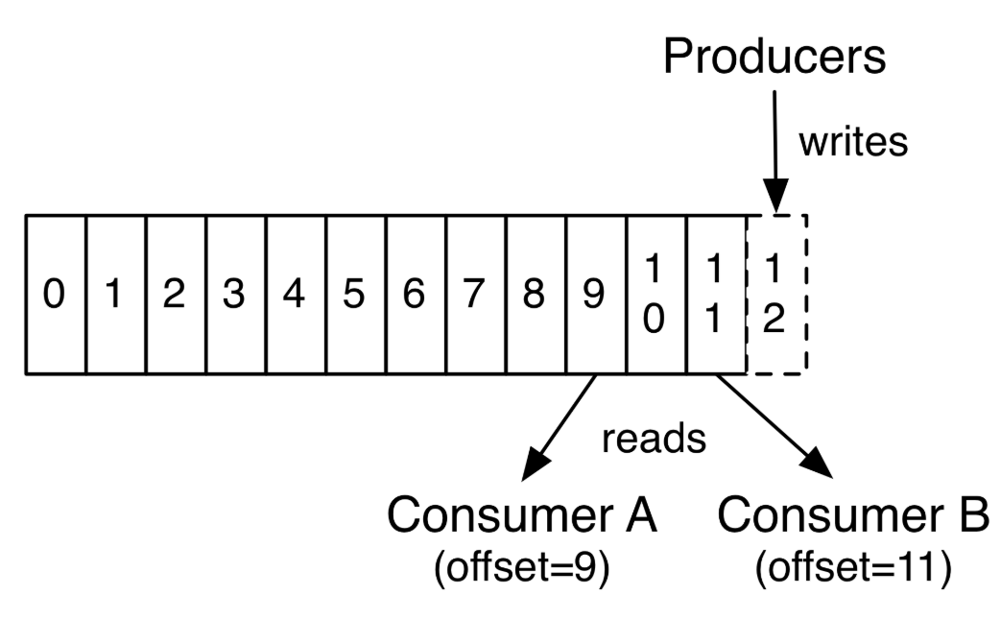
事实上，在每个消费者上保留的唯一元数据是消费者在日志中的偏移位置。这个偏移由消费者控制：通常消费者会在读取记录时线性地提高其偏移值（offset++），但实际上，由于偏移位置由消费者控制，它可以以任何顺序来处理数据记录。 例如，消费者可以重置为较旧的偏移量以重新处理来自过去的数据，或者跳过之前的记录，并从“现在”开始消费。 这种特征的组合意味着Kafka消费者非常轻量级 ——随意的开启和关闭并不会对其他的消费者有大的影响。例如，您可以使用我们的命令行工具tail来查看任何主题的内容，而无需更改任何现有消费者所消耗的内容。 
日志中的分区有几个目的。 首先，它保证日志的扩展性，主题的大小不受单个服务器大小的限制。每个单独的分区大小必须小于托管它的服务器磁盘大小，但主题可能有很多分区，因此它可以处理任意数量的海量数据。第二，它可以作为并行处理的单位。
### 7. 数据的分配
在Kafka集群中，不同分区日志的分布在相应的不同的服务器节点上，每个服务器节点处理自己分区对应的数据和请求。每个分区都会被复制备份到几个（可配置）服务器节点，以实现容错容灾。 分布在不同节点的同一个分区都会有一个服务器节点作为领导者（”leader”）和0个或者多个跟随者（”followers”）. 分区的领导者会处理所有的读和写请求，而跟随者只会被动的复制领导者.如果leader挂了, 一个follower会自动变成leader。每个服务器都会作为其一些分区的领导者，但同时也可能作为其他分分区的跟随者，Kafka以此来实现在集群内的负载平衡
### 8. 生产者
生产者将数据发布到他们选择的主题。 生产者负责选择要吧数据分配给主题中哪个分区。这可以通过循环方式（round-robin）简单地平衡负载，或者可以根据某些语义分区（例如基于数据中的某些关键字）来完成
### 9. 消费者
消费者们使用消费群组名称来标注自己，几个消费者共享一个组群名，每一个发布到主题的数据会被传递到每个消费者群组中的一个消费者实例。 消费者实例可以在不同的进程中或不同的机器上。 如果所有的消费者实例具有相同的消费者组，则记录将在所有的消费者实例上有效地负载平衡,每个数据只发到了一个消费者 如果所有的消费者实例都有不同的消费者群体，那么每个记录将被广播给所有的消费者进程，每个数据都发到了所有的消费者。
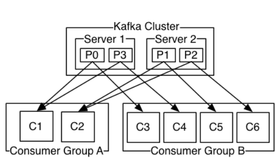
### 10. Kafka集群中的保证
在高可用的Kafka集群中，我们有如下的保证:

- 生产者发送到特定主题分区的消息将按照发送的顺序进行追加。 也就是说，如果记录M1由与记录M2相同的制造者发送，并且首先发送M1，则M1将具有比M2更低的偏移并且在日志中较早出现。
- 消费者实例观察到数据的顺序，与它们存储在日志中的顺序一致。
- 对于具有复制因子N的主题，我们将容忍最多N-1个服务器故障，而不会丢失提交到日志的任何记录。

### 11. Kafka作为消息系统
Kafka的数据流概念与传统的企业消息系统相比如何？ 消息系统传统上有两种模式: 队列和发布-订阅. 在队列中，消费者池可以从服务器读取，每条记录都转到其中一个; 在发布订阅中，记录将广播给所有消费者。 这两个模型中的每一个都有优点和缺点。 排队的优点是它允许您在多个消费者实例上分配数据处理，从而可以扩展您的处理。 不幸的是，队列支持多用户，一旦一个进程读取数据就没有了。 发布订阅允许您将数据广播到多个进程，但无法缩放和扩容，因为每个消息都发送给每个订阅用户。 卡夫卡消费群体概念概括了这两个概念。 与队列一样，消费者组允许您通过一系列进程（消费者组的成员）来划分处理。 与发布订阅一样，Kafka允许您将消息广播到多个消费者组。 Kafka模型的优点是，每个主题都具有这两个属性，它可以进行缩放处理，也是多用户的，没有必要选择一个而放弃另一个。 卡夫卡也比传统的消息系统有更强大的消息次序保证。 传统队列在服务器上保存顺序的记录，如果多个消费者从队列中消费，则服务器按照存储顺序输出记录。 然而，虽然服务器按顺序输出记录，但是记录被异步传递给消费者，所以它们可能会在不同的消费者处按不确定的顺序到达。 这意味着在并行消耗的情况下，记录的排序丢失。 消息传递系统通常通过使“唯一消费者”的概念只能让一个进程从队列中消费，但这当然意味着处理中没有并行性。 卡夫卡做得更好。通过分区，在一个主题之内的并行处理，Kafka能够在消费者流程池中，即提供排序保证，也负载平衡。这是通过将主题中的分区分配给消费者组中的消费者来实现的，以便每一个分区由组中的一个消费者使用。 通过这样做，我们确保消费者是该分区的唯一读者，并按顺序消耗数据。 由于有许多分区，这仍然平衡了许多消费者实例的负载。 但是请注意，消费者组中的消费者实例个数不能超过分区的个数。
### 12. Kafka作为存储系统
任何允许发布消息，解耦使用消息的消息队列，都在本质上充当传输中途消息的存储系统。 卡夫卡的不同之处在于它是一个很好的存储系统。 写入Kafka的数据写入磁盘并进行复制以进行容错。 Kafka允许生产者等待写入完成的确认，这样在数据完全复制之前，写入是未完成的，并且即使写入服务器失败，也保证持久写入。 Kafka的磁盘结构使用可以很好的扩容，无论您在服务器上是否有50KB或50TB的持久数据，Kafka都能保持稳定的性能。 由于对存储花费了很多精力，并允许客户端控制其读取位置，您可以将Kafka视为，专用于高性能，低延迟的日志存储复制和传播的专用分布式文件系统。
### 13. Kafka用于流数据处理
仅读取，写入和存储数据流是不够的，Kafka的目的是实现流的实时处理。 在Kafka中，流处理器的定义是：任何从输入主题接收数据流，对此输入执行一些处理，并生成持续的数据流道输出主题的组件。 例如，零售应用程序可能会收到销售和出货的输入流，并输出根据该数据计算的重新排序和价格调整的输出流。 当然我们也可以直接用producer and consumer APIs在做简单的出列. 然而对于更复杂的转换，Kafka提供了一个完全集成的Streams API。这允许我们构建应用程序进行更复杂的运算，或者聚合，或将流连接在一起。 该设施有助于解决这种类型的应用程序面临的困难问题：处理无序数据，重新处理输入作为代码更改，执行有状态计算等。 Stream API基于Kafka提供的核心原语构建：它使用生产者和消费者API进行输入，使用Kafka进行有状态存储，并在流处理器实例之间使用相同的组机制来实现容错。
## 2. Kafka搭建
以Docker Compose安装：
### 1. docker compose 简介
Compose是一个用于定义和运行多容器Docker应用程序的工具。使用Compose，可以使用YAML文件来配置应用程序的服务。然后，使用单个命令，您可以从配置中创建并启动所有服务。使用docker compose基本为以下三个步骤：

- 使用Dockerfile定义应用程序的环境，以便可以在任何地方进行复制。
- 在docker-compose.yml中定义构成应用程序的服务，以便它们可以在隔离环境中一起运行
- 运行docker-compose up和Compose启动并运行整个应用程序。

### 2. docker compose 安装(linux)

- 下载docker compose:
  ````
  sudo curl -L "https://github.com/docker/compose/releases/download/1.23.2/docker-compose-$(uname -s)-$(uname -m)" -o /usr/local/bin/docker-compose
  ````
  (要安装不同版本的Compose，只需将1.23.2替换为要使用的Compose版本。)
- 对二进制文件应用可执行权限：
  ````
  sudo chmod +x /usr/local/bin/docker-compose
  ````
- 查看当前安装docker compose版本：
  ````
  docker-compose --version
  ````

### 3. zookeeper 

- 简介
  ZooKeeper是一个分布式的，开放源码的分布式应用程序协调服务，是Google的Chubby一个开源的实现，它是集群的管理者，监视着集群中各个节点的状态根据节点提交的反馈进行下一步合理操作。最终，将简单易用的接口和性能高效、功能稳定的系统提供给用户。
- 通知机制
  客户端注册监听它关心的目录节点，当目录节点发生变化（数据改变、被删除、子目录节点增加删除）时，zookeeper会通知客户端。
- 配置管理
  程序总是需要配置的，如果程序分散部署在多台机器上，要逐个改变配置就变得困难。现在把这些配置全部放到zookeeper上去，保存在 Zookeeper 的某个目录节点中，然后所有相关应用程序对这个目录节点进行监听，一旦配置信息发生变化，每个应用程序就会收到 Zookeeper 的通知，然后从 Zookeeper 获取新的配置信息应用到系统中就好。
- 集群管理
  所谓集群管理无在乎两点：是否有机器退出和加入、选举master。 对于第一点，所有机器约定在父目录GroupMembers下创建临时目录节点，然后监听父目录节点的子节点变化消息。一旦有机器挂掉，该机器与 zookeeper的连接断开，其所创建的临时目录节点被删除，所有其他机器都收到通知：某个兄弟目录被删除。新机器加入也是类似，所有机器收到通知：新兄弟目录加入。
- 分布式锁
  有了zookeeper的一致性文件系统，锁的问题变得容易。锁服务可以分为两类，一个是保持独占，另一个是控制时序。对于第一类，我们将zookeeper上的一个znode看作是一把锁，通过createznode的方式来实现。所有客户端都去创建 /distribute_lock 节点，最终成功创建的那个客户端也即拥有了这把锁。用完删除掉自己创建的distribute_lock 节点就释放出锁。 对于第二类， /distribute_lock 已经预先存在，所有客户端在它下面创建临时顺序编号目录节点，和选master一样，编号最小的获得锁，用完删除，依次方便。
- 队列管理
   - 同步队列，当一个队列的成员都聚齐时，这个队列才可用，否则一直等待所有成员到达。 
   - 队列按照 FIFO 方式进行入队和出队操作。

   第一类，在约定目录下创建临时目录节点，监听节点数目是否是我们要求的数目。 
   第二类，和分布式锁服务中的控制时序场景基本原理一致，入列有编号，出列按编号。
- zookeeper在kafka中的作用
  Kafka将元数据信息保存在Zookeeper中，但是发送给Topic本身的数据是不会发到Zk上的，否则Zk就疯了。kafka使用zookeeper来实现动态的集群扩展，不需要更改客户端（producer和consumer）的配置。broker会在zookeeper注册并保持相关的元数据（topic，partition信息等）更新。而客户端会在zookeeper上注册相关的watcher。一旦zookeeper发生变化，客户端能及时感知并作出相应调整。这样就保证了添加或去除broker时，各broker间仍能自动实现负载均衡。这里的客户端指的是Kafka的消息生产端(Producer)和消息消费端(Consumer)Producer端使用zookeeper用来"发现"broker列表,以及和Topic下每个partition的leader建立socket连接并发送消息。也就是说每个Topic的partition是由Lead角色的Broker端使用zookeeper来注册broker信息,以及监测partition leader存活性.Consumer端使用zookeeper用来注册consumer信息,其中包括consumer消费的partition列表等,同时也用来发现broker列表,并和partition leader建立socket连接,并获取消息.

### 4. zookeeper、kafka、kafka-manager简单安装

- 创建并编辑docker-compose.yml文件
  ````yaml
    version: '2'
    services:
      zookeeper:
        image: zookeeper
        ports:
          - "2181:2181"     
        container_name: myzookeeper
    
                   
      kafka:
        image: wurstmeister/kafka       
        volumes: 
            - /etc/localtime:/etc/localtime 
        ports:
          - "9092:9092"
        environment:
          KAFKA_ADVERTISED_HOST_NAME: 47.106.81.161
          KAFKA_ZOOKEEPER_CONNECT: zookeeper01:2181
        container_name: kafka                  
    
           
      kafka-manager:  
        image: sheepkiller/kafka-manager                
        environment:
            ZK_HOSTS: 47.106.81.161                   
        ports:  
          - "9000:9000"                                 
        container_name: kafka-manager
  ````
- 运行

### 5. 集群部署  

- 创建并编辑docker-compose.yml文件并运行
  ````yaml
  version: '2'
  services:
    zookeeper01:
      image: zookeeper
      ports:
        - "2181:2181"     
      container_name: myzookeeper01
  
    zookeeper02:
      image: zookeeper
      ports:
        - "2182:2181"     
      container_name: myzookeeper02
              
    kafka01:
      image: wurstmeister/kafka       
      volumes: 
          - /etc/localtime:/etc/localtime 
      ports:
        - "9092:9092"
      environment:
        KAFKA_ADVERTISED_HOST_NAME: 47.106.81.161
        KAFKA_ZOOKEEPER_CONNECT: zookeeper01:2181,zookeeper02:2182
      container_name: kafka01                     
  
    kafka02:
      image: wurstmeister/kafka       
      volumes: 
          - /etc/localtime:/etc/localtime 
      ports:
        - "9093:9092"
      environment:
        KAFKA_ADVERTISED_HOST_NAME: 47.106.81.161
        KAFKA_ZOOKEEPER_CONNECT: zookeeper01:2181,zookeeper02:2182
      container_name: kafka02             
  
    kafka-manager:  
      image: sheepkiller/kafka-manager                
      environment:
          ZK_HOSTS: 47.106.81.161                   
      ports:  
        - "9000:9000"                                 
  
  ````
 - 可能遇到的问题
   - 问题：使用docker 启动kafka时出现秒退
   - 原因：kafka需要大量内存，磁盘内存不足，kafka无法启动，默认启动为1G
## 3. 实践(框架为springboot)
### 1. 添加依赖

````xml
    <dependency>
       <groupId>org.springframework.kafka</groupId>
       <artifactId>spring-kafka</artifactId>
    </dependency>
````

注意：spring-kafka实际上也是对apache的kafka-client进行了包装和开发，所以使用的时候一定注意，引入的spring-kafka里封装的kafka-client的版本要和服务器上的kafka服务器版本要对应，不然就会产生问题，比如消费失败。对应版本如下：

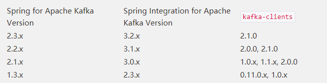

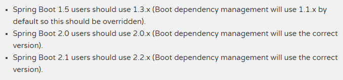

 具体可参考官方文档：https://spring.io/projects/spring-kafka#overview 
### 2. 消息发送
KafkaTemplate中有以下send()方法：

````java
    public ListenableFuture<SendResult<K, V>> sendDefault(V data) {
        return this.send(this.defaultTopic, data);
    }

    public ListenableFuture<SendResult<K, V>> sendDefault(K key, V data) {
        return this.send(this.defaultTopic, key, data);
    }

    public ListenableFuture<SendResult<K, V>> sendDefault(int partition, K key, V data) {
        return this.send(this.defaultTopic, partition, key, data);
    }

    public ListenableFuture<SendResult<K, V>> send(String topic, V data) {
        ProducerRecord<K, V> producerRecord = new ProducerRecord(topic, data);
        return this.doSend(producerRecord);
    }

    public ListenableFuture<SendResult<K, V>> send(String topic, K key, V data) {
        ProducerRecord<K, V> producerRecord = new ProducerRecord(topic, key, data);
        return this.doSend(producerRecord);
    }

    public ListenableFuture<SendResult<K, V>> send(String topic, int partition, V data) {
        ProducerRecord<K, V> producerRecord = new ProducerRecord(topic, partition, (Object)null, data);
        return this.doSend(producerRecord);
    }

    public ListenableFuture<SendResult<K, V>> send(String topic, int partition, K key, V data) {
        ProducerRecord<K, V> producerRecord = new ProducerRecord(topic, partition, key, data);
        return this.doSend(producerRecord);
    }

    public ListenableFuture<SendResult<K, V>> send(ProducerRecord<K, V> record) {
        return this.doSend(record);
    }

    public ListenableFuture<SendResult<K, V>> send(Message<?> message) {
        ProducerRecord<?, ?> producerRecord = this.messageConverter.fromMessage(message, this.defaultTopic);
        return this.doSend(producerRecord);
    }
````
- 各参数含义：
  - topic：这里填写的是Topic的名字
  - partition：这里填写的是分区的id，其实也是就第几个分区，id从0开始。表示指定发送到该分区中
  - timestamp：时间戳，一般默认当前时间戳  
  - key：消息的键
  - data：消息的数据
  - ProducerRecord：消息对应的封装类，包含上述字段
  - Message<?>：Spring自带的Message封装类，包含消息及消息
- 关于ProducerRecord:
  - 内部数据结构：
    ````java
      private final String topic;
      private final Integer partition;
      private final K key;
      private final V value;
      private final Long timestamp;
    ````
   - 数据发送了逻辑：
     - 若指定Partition,则数据被发送至指定Partition
     - 若未指定Partition,但指定了Key, 数据会按照hasy(key)发送至对应Partition
     - 若既未指定Partition也没指定Key，数据会按照round-robin模式发送到每个Partition
     - 若同时指定了Partition和Key, 数据只会发送到指定的Partition (Key不起作用，代码逻辑决定)
  - 数据发送实现：
    ````java
      public ProducerRecord(String topic, Integer partition, K key, V value) {
          this(topic, partition, (Long)null, key, value);
      }
   
      public ProducerRecord(String topic, K key, V value) {
          this(topic, (Integer)null, (Long)null, key, value);
      }
          
      public ProducerRecord(String topic, V value) {
          this(topic, (Integer)null, (Long)null, (Object)null, value);
      }
    ````
- 注意：
  send() 方法默认则是异步的，若要同步只需要调用它的 get() 方法即可同步获取发送结果。
- 简单示例
     ````java
       Message message = new Message();
       message.setId(System.currentTimeMillis());
       message.setMsg(UUID.randomUUID().toString());
       message.setSendTime(new Date());
       System.out.println("+++++++++++++++++++++send01:  message = {}"+ gson.toJson(message));
       kafkaTemplate.send("yan","3",gson.toJson(message));
     ````

### 3. 消息监听及接收

- 使用@KafkaListener来注解实现监听的方法
- 监听方法可接收参数
    - Data:对于data值的类型其实并没有限定，根据KafkaTemplate所定义的类型来决定。data为List集合的则是用作批量消费。
    - ConsumerRecord：具体消费数据类，包含Headers信息、分区信息、时间戳等
    - Acknowledgment：用作Ack机制的接口
    - Consumer：消费者类，使用该类我们可以手动提交偏移量、控制消费速率等功能
- @KafkaListner可添加属性
    - id：消费者的id，当GroupId没有被配置的时候，默认id为GroupId
    - containerFactory：上面提到了@KafkaListener区分单数据还是多数据消费只需要配置一下注解的containerFactory属性就可以了，这里面配置的是监听容器工厂，也就是ConcurrentKafkaListenerContainerFactory，配置BeanName
    - topics：需要监听的Topic，可监听多个
    - topicPartitions：可配置更加详细的监听信息，必须监听某个Topic中的指定分区，或者从offset为200的偏移量开始监听
- 使用ConsumerRecord类消费的优点 
  ConsumerRecord类里面包含分区信息、消息头、消息体等内容，如果业务需要获取这些参数时，使用ConsumerRecord会是个不错的选择
  <br>简单示例:
   ````java
    @KafkaListener(topics = {"yan"})
    public void listen(ConsumerRecord<?, ?> record) {
        Optional<?> kafkaMessage = Optional.ofNullable(record.value());
        if (kafkaMessage.isPresent()) {
            Object message = kafkaMessage.get();
            System.out.println("-----------------receive record =" + record);
            System.out.println("-----------------receive  message =" + message);
        }
    }
  
   ````

### 4. ACK机制确认消费
与rabbitmq不同，Kafka是通过最新保存偏移量进行消息消费的，而且确认消费的消息并不会立刻删除，所以我们可以重复的消费未被删除的数据，当第一条消息未被确认，而第二条消息被确认的时候，Kafka会保存第二条消息的偏移量，也就是说第一条消息再也不会被监听器所获取，除非是根据第一条消息的偏移量手动获取。

- Kafka的Ack机制比较简单，只需简单的三步即可：
  - 设置ENABLE_AUTO_COMMIT_CONFIG=false，禁止自动提交
  - 设置AckMode=MANUAL_IMMEDIATE
  - ````properties
     spring.kafka.consumer.enable-auto-commit=false
     spring.kafka.listener.ack-mode=manual_immediate
     ````
  - 监听方法加入Acknowledgment ack 参数
- 确认消息只需添加ack.acknowledge()方法，拒绝消息只需要注释掉上述方法即可


​     


​     

